# Documentação Técnica - Fluxo N8N: Agente de Criação de Conteúdo (SUGESTÕES)

## 📚 Índice

1.  [Visão Geral da Arquitetura e Replicação](#1-visão-geral-da-arquitetura-e-replicação)
2.  [Diagrama do Fluxo](#2-diagrama-do-fluxo)
3.  [Detalhamento do Fluxo por Fases](#3-detalhamento-do-fluxo-por-fases)
    *   [FASE 1: Ativação e Coleta de Dados](#fase-1-ativação-e-coleta-de-dados)
    *   [FASE 2: Pesquisa Aprofundada](#fase-2-pesquisa-aprofundada)
    *   [FASE 3: Criação de Roteiro](#fase-3-criação-de-roteiro)
    *   [FASE 4: Geração Visual](#fase-4-geração-visual)
    *   [FASE 5: Armazenamento e Processamento de Artes](#fase-5-armazenamento-e-processamento-de-artes)
    *   [FASE 6: Atualização e Notificação](#fase-6-atualização-e-notificação)
4.  [Resumo de APIs, Plataformas e Credenciais](#4-resumo-de-apis-plataformas-e-credenciais)
5.  [Agentes de IA da Tess Utilizados](#5-agentes-de-ia-da-tess-utilizados)
6.  [Fluxo de Processamento em Tempo Real](#6-fluxo-de-processamento-em-tempo-real)
7.  [Arquivo JSON](#7-arquivo-json)


## 1. Visão Geral da Arquitetura e Replicação

Este fluxo de trabalho, orquestrado no N8N, automatiza a criação de conteúdo para redes sociais a partir de temas sugeridos em uma planilha do Google. A arquitetura utiliza um modelo orientado a eventos, iniciado por um webhook. Ele integra diversas APIs, incluindo **Google Workspace (Sheets, Drive, Gmail, Chat)** para manipulação de dados e notificações, a plataforma **Tess AI** para as tarefas de inteligência artificial (pesquisa, roteirização e geração de conteúdo), e o serviço **HTML/CSS-to-Image** para a conversão de código em imagens.

O fluxo segue 5 fases principais: **Ativação**, **Pesquisa**, **Criação**, **Geração Visual** e **Finalização**.

### Passo a Passo para Replicar o Fluxo SUGESTÕES

Para replicar este fluxo em seu próprio ambiente, siga as etapas abaixo.

#### **Etapa 1: Preparar Ativos (Credenciais, Agentes e Pasta)**

Antes de importar o fluxo, você precisa preparar todos os recursos externos.

1.  **Credenciais no N8N:** Acesse sua instância do N8N e, na seção **Credentials**, crie as credenciais essenciais para este fluxo (Google Sheets, Google Drive, Tess AI, Htmlcsstoimg API, etc.).
2.  **Agentes na Tess AI:** Os IDs dos agentes são únicos por workspace. Você precisa recriá-los:
    *   Consulte a seção **"6. Agentes de IA Utilizados"** deste documento para ver a lista de agentes (ex: 32754, 32061, etc.).
    *   Em seu próprio workspace da Tess AI, **crie ou duplique cada agente**, utilizando os mesmos prompts e configurações do fluxo original.
    *   Anote os **novos IDs** de cada um dos seus agentes.
3.  **Pasta no Drive:** Crie uma pasta principal no seu Google Drive onde as artes serão salvas e copie o **ID da pasta** (a parte final do URL).

#### **Etapa 2: Replicar a Planilha de Controle**

1.  **Faça uma cópia** do template da planilha: [**Template - Planilha de Controle**](https://docs.google.com/spreadsheets/d/18jAJI2m42CHGPKLJkozDQVHs3cH1msQZuvJHef3G3NY/edit).
2.  Em sua nova planilha, acesse **`Extensões > Apps Script`** e conceda as permissões de execução do script.

#### **Etapa 3: Importar e Configurar o Fluxo no N8N**

1.  **Importe o arquivo JSON** deste fluxo (`SUGESTÕES`) para a sua instância do N8N.
2.  **Copie o URL do seu novo Webhook** no nó `Webhook` (aba "Production").
3.  **Cole o Webhook na sua Planilha** no Apps Script, na variável `WEBHOOK_URL_SUGESTOES`, e salve.
4.  **Atualize os IDs no N8N:**
    *   **Pasta do Drive:** No nó `Create folder1`, cole o **ID da sua pasta** no campo "Parent Folder ID".
    *   **Agentes de IA:** Nos nós que fazem chamadas para a Tess AI (ex: `TESS - Agente de Pesquisa Aprofundada`), **substitua os IDs dos agentes antigos pelos novos IDs** que você criou.
5.  **Verifique os Nós Manualmente:** Percorra os demais nós para confirmar se suas credenciais foram associadas corretamente.

>*Observação: É importante ressaltar que, para UTILIZAR a planilha de Criação de Conteúdo, não é necessário ter acesso ao N8N. Mas sim, ter as permissões do Google AppScript configuradas.*


## 2. Diagrama do Fluxo

```mermaid
graph TD
    subgraph FASE1["FASE 1: ATIVACAO E COLETA"]
        A["Webhook<br/>POST Event"] --> B["Get rows<br/>Busca linhas"]
        B --> C["Filter1<br/>Valida campos"]
    end

    subgraph FASE2["FASE 2: PESQUISA APROFUNDADA"]
        D["Pre Pesquisa<br/>Formata dados"] --> E["Gerar Temas<br/>Tess AI"]
        E --> F["Wait 60s"]
        F --> G["GET Pesquisa<br/>Coleta resultado"]
    end

    subgraph FASE3["FASE 3: CRIACAO DE ROTEIRO"]
        H["Pos Pesquisa<br/>Formata saida"] --> I["Criador Roteiro<br/>Tess AI"]
        I --> J["Wait 30s"]
        J --> K["GET Roteiro<br/>Coleta resultado"]
    end

    subgraph FASE4["FASE 4: GERACAO VISUAL"]
        L["Pos Roteiro<br/>Prepara para imagens"] --> M["Criador FUNDO<br/>Tess AI"]
        M --> N["Wait 45s"]
        N --> O["GET Imagens<br/>Coleta URLs"]
        O --> P["JSON Parse<br/>Combina dados"]
        P --> Q["Criar HTML<br/>Tess AI"]
        Q --> R["Wait 45s"]
        R --> S["GET HTML<br/>Coleta codigo"]
        S --> T["Dados Conteudo<br/>Extrai metadados"]
    end

    subgraph FASE5["FASE 5: ARMAZENAMENTO"]
        U["Create Folder<br/>Google Drive"] --> V["Dividir HTML<br/>Separa arquivos"]
        V --> W["Loop Items"]
        W --> X["HTML to PNG<br/>Conversao"]
        X --> Y["Download<br/>Baixa PNG"]
        Y --> Z["Upload Drive<br/>Salva no Drive"]
        Z -->|Proximo| W
        Z -->|Fim| AA["Wait 10s"]
        AA --> AB["Atualizar Planilha<br/>Google Sheets"]
    end

    subgraph FASE6["FASE 6: NOTIFICACAO"]
        AC["Send Email<br/>Gmail"] --> AD["Send GChat<br/>Google Chat"]
        AD --> AE["Conclusao"]
    end

    C --> D
    G --> H
    K --> L
    T --> U
    AB --> AC

    style FASE1 fill:#e3f2fd
    style FASE2 fill:#f3e5f5
    style FASE3 fill:#fff3e0
    style FASE4 fill:#e8f5e9
    style FASE5 fill:#fce4ec
    style FASE6 fill:#c8e6c9
```




## 3. Detalhamento do Fluxo por Fases

### FASE 1: Ativação e Coleta de Dados

Esta fase inicial é responsável por acionar o fluxo e buscar os dados de entrada da planilha.


#### **Nó 1: `Webhook`**
*   **Tipo:** `n8n-nodes-base.webhook`
*   **Descrição:** Ponto de entrada da automação. Aguarda uma requisição `POST` disparada por um gatilho na planilha do Google Sheets, indicando que uma nova sugestão de tema foi adicionada.
*   **Configuração:**
    *   Método HTTP: `POST`
    *   Caminho: `875e9b9e-0a28-4955-ac8e-9ee5706752a3`
*   **Plataforma:** N8N (nativo).
*   **Credenciais:** Nenhuma.

#### **Nó 2: `Get row(s) in sheet`**
*   **Tipo:** `n8n-nodes-base.googleSheets`
*   **Descrição:** Conecta-se à planilha de controle, aba "Sugestão de Temas", e busca linhas onde `"Post sugerido?"` = `false`.
*   **Configuração:**
    *   ID do Documento: `1V3A3ClTlg4waudwwiP1lHlrqNv-I96fNmcYilR_5RUY`
    *   Nome da Aba: `Sugestão de Temas` (gid: 200832694)
    *   Filtro: `"Post sugerido?" = false`
    *   Coletas: Tema, Motivo da Escolha, Explicacao do Tema, Referência (opcional)
*   **Plataforma:** Google Sheets.
*   **Credenciais:** Campo `googleSheetsOAuth2Api` em N8N | Autenticação: OAuth2.

#### **Nó 3: `Filter1`**
*   **Tipo:** `n8n-nodes-base.filter`
*   **Descrição:** Valida se a coluna `"Explicacao do Tema"` não está vazia, garantindo que haja contexto suficiente para a IA prosseguir.
*   **Configuração:**
    *   Condição: `"Explicacao do Tema"` não está vazio
    *   Validação de Tipo: Strict
*   **Plataforma:** N8N (nativo).
*   **Credenciais:** Nenhuma.

---

### FASE 2: Pesquisa Aprofundada

Nesta fase, um agente de IA realiza uma pesquisa aprofundada sobre o tema proposto para enriquecer o contexto.


#### **Nó 4: `Pré Pesquisa Aprofundada1`**
*   **Tipo:** `n8n-nodes-base.code`
*   **Descrição:** Nó de código que formata os dados da planilha em um payload JSON estruturado para o agente de IA.
*   **Payload:**
    ```json
    {
      "messages": [
        {
          "role": "user",
          "content": "gerar_itens_para_pesquisa(...)"
        }
      ],
      "tema_escolhido": "{{ Tema }}",
      "specific_details": "{{ Explicacao do Tema }}",
      "motivo_da_escolha": "{{ Motivo da Escolha }}",
      "wait_execution": true
    }
    ```
*   **Plataforma:** N8N (nativo).
*   **Credenciais:** Nenhuma.

#### **Nó 5: `TESS - Agente de Pesquisa Aprofundada - Gerar temas1`**
*   **Tipo:** `n8n-nodes-base.httpRequest`
*   **Descrição:** Faz uma requisição `POST` para o agente de IA Tess que gera temas pesquisáveis sobre o tema proposto.
*   **Configuração:**
    *   Método: `POST`
    *   URL: `https://tess.pareto.io/api/agents/XXXXX/execute`
    *   Headers: `Authorization: Bearer {{ TOKEN }}`
    *   Body: JSON formatado do nó anterior
    *   Timeout: 220 segundos
*   **Plataforma:** Tess AI.
*   **Credenciais:** Campo `Authorization` (Header) | Bearer Token.
*   **Agente Tess Utilizado:** `Agente de Pesquisa Aprofundada - Gerar Temas`.

#### **Nó 6: `TESS - Agente de Pesquisa Aprofundada - Aprofundar1`**
*   **Tipo:** `n8n-nodes-base.httpRequest`
*   **Descrição:** Faz uma requisição `POST` para continuar o processamento, aprofundando a pesquisa sobre os temas gerados.
*   **Configuração:**
    *   Método: `POST`
    *   URL: `https://tess.pareto.io/api/agents/32754/execute`
    *   Body: JSON com `root_id` da resposta anterior
*   **Plataforma:** Tess AI.
*   **Credenciais:** Campo `Authorization` (Header) | Bearer Token.
*   **Agente Tess Utilizado:** `Agente de Pesquisa Aprofundada - Aprofundar` (ID: `32754`).

#### **Nó 7: `Wait 60s1`**
*   **Tipo:** `n8n-nodes-base.wait`
*   **Descrição:** Aguarda 60 segundos para que o agente de IA processe a requisição de pesquisa.
*   **Plataforma:** N8N (nativo).
*   **Credenciais:** Nenhuma.

#### **Nó 8: `GET | TESS - Agente Identificador de Tendências2`**
*   **Tipo:** `n8n-nodes-base.httpRequest`
*   **Descrição:** Faz uma requisição `GET` para coletar o resultado da pesquisa realizada pelo agente anterior.
*   **Configuração:**
    *   Método: `GET`
    *   URL: `https://tess.pareto.io/api/agent-responses/{{ $json.responses[0].id }}`
    *   Headers: `Authorization: Bearer {{ TOKEN }}`
*   **Plataforma:** Tess AI.
*   **Credenciais:** Campo `Authorization` (Header) | Bearer Token.
*   **Saída:** JSON com campo `output` contendo a pesquisa aprofundada.

---

### FASE 3: Criação de Roteiro

Nesta fase, o agente de IA transforma a pesquisa em um roteiro estruturado para o carrossel do Instagram.


#### **Nó 9: `Pós Pesquisa Aprofundada`**
*   **Tipo:** `n8n-nodes-base.code`
*   **Descrição:** Formata o resultado da pesquisa e o tema em um payload estruturado para o agente de roteiros.
*   **Payload:**
    ```json
    {
      "messages": [
        {
          "role": "user",
          "content": "Transformar o tema escolhido em um roteiro completo para carrossel..."
        }
      ],
      "tema-escolhido": "{{ Tema }}",
      "motivo": "{{ Motivo da Escolha }}",
      "explicacao": "{{ Explicacao do Tema }}",
      "referencia": "{{ Referência (opcional) }}",
      "pesquisa-sobre-o-tema": "{{ Resultado da pesquisa }}",
      "wait_execution": true
    }
    ```
*   **Plataforma:** N8N (nativo).
*   **Credenciais:** Nenhuma.

#### **Nó 10: `TESS - Criador de Roteiro de Post Instagram`**
*   **Tipo:** `n8n-nodes-base.httpRequest`
*   **Descrição:** Envia o tema, pesquisa e referências para o agente de IA que estrutura o post em formato de carrossel, definindo textos, dimensões de imagens e diretrizes visuais.
*   **Configuração:**
    *   Método: `POST`
    *   URL: `https://tess.pareto.io/api/agents/32061/execute`
    *   Headers: `Authorization: Bearer {{ TOKEN }}`
    *   Body: JSON formatado
    *   Timeout: 220 segundos
*   **Plataforma:** Tess AI.
*   **Credenciais:** Campo `Authorization` (Header) | Bearer Token.
*   **Agente Tess Utilizado:** `Criador de Roteiro de Post Instagram` (ID: `32061`).

#### **Nó 11: `Wait 30s1`**
*   **Tipo:** `n8n-nodes-base.wait`
*   **Descrição:** Aguarda 30 segundos para que o roteiro seja processado.
*   **Plataforma:** N8N (nativo).
*   **Credenciais:** Nenhuma.

#### **Nó 12: `GET | TESS - Agente Criador Carrosséis Instagram`**
*   **Tipo:** `n8n-nodes-base.httpRequest`
*   **Descrição:** Coleta o roteiro pronto do agente anterior.
*   **Configuração:**
    *   Método: `GET`
    *   URL: `https://tess.pareto.io/api/agent-responses/{{ $json.responses[0].id }}`
    *   Headers: `Authorization: Bearer {{ TOKEN }}`
*   **Plataforma:** Tess AI.
*   **Credenciais:** Campo `Authorization` (Header) | Bearer Token.
*   **Saída:** JSON com campo `output` contendo o roteiro estruturado.

---

### FASE 4: Geração Visual

Nesta fase, dois agentes de IA trabalham em paralelo conceitual para gerar imagens de fundo e montar os slides em HTML.


#### **Nó 13: `Pós criação de roteiro`**
*   **Tipo:** `n8n-nodes-base.code`
*   **Descrição:** Prepara o roteiro para o agente de geração de imagens de fundo, fornecendo especificações detalhadas.
*   **Payload:**
    ```json
    {
      "messages": [
        {
          "role": "user",
          "content": "Gerar imagens de fundo para carrosel do Instagram, com 1080x1080 de tamanho..."
        }
      ],
      "briefing-do-carrossel": "{{ Roteiro }}",
      "wait_execution": false
    }
    ```
*   **Plataforma:** N8N (nativo).
*   **Credenciais:** Nenhuma.

#### **Nó 14: `TESS - Agente Criador Carrosséis Instagram [FUNDO]`**
*   **Tipo:** `n8n-nodes-base.httpRequest`
*   **Descrição:** Chama o agente de IA que gera as imagens de fundo (1080x1080px) para cada slide do carrossel com base no roteiro.
*   **Configuração:**
    *   Método: `POST`
    *   URL: `https://tess.pareto.io/api/agents/32060/execute`
    *   Headers: `Authorization: Bearer {{ TOKEN }}`
    *   Body: JSON com roteiro
    *   Timeout: 220 segundos
*   **Plataforma:** Tess AI.
*   **Credenciais:** Campo `Authorization` (Header) | Bearer Token.
*   **Agente Tess Utilizado:** `Agente Criador Carrosséis Instagram [FUNDO]` (ID: `32060`).

#### **Nó 15: `Wait 45s` + Nó 16: `GET Imagens Fundo`**
*   **Tipo:** `n8n-nodes-base.wait` + `n8n-nodes-base.httpRequest`
*   **Descrição:** Aguarda 45 segundos e coleta as URLs das imagens de fundo geradas.
*   **Configuração (GET):**
    *   Método: `GET`
    *   URL: `https://tess.pareto.io/api/agent-responses/{{ $json.responses[0].id }}`
    *   Headers: `Authorization: Bearer {{ TOKEN }}`
*   **Plataforma:** N8N e Tess AI.
*   **Credenciais:** Bearer Token para requisição GET.
*   **Saída:** JSON com campo `output` contendo URLs das imagens.

#### **Nó 17: `JSON Parse3`**
*   **Tipo:** `n8n-nodes-base.code`
*   **Descrição:** Combina o roteiro com os links das imagens de fundo em um payload para o agente de HTML.
*   **Payload:**
    ```json
    {
      "messages": [
        {
          "role": "user",
          "content": "Gerar o HTML para cada slide do carrossel, respeitando os inputs..."
        }
      ],
      "briefing": "{{ Roteiro }}",
      "url-das-imagens-de-fundo": "{{ URLs das imagens }}",
      "nome-do-perfil-do-instagram": "@ramon_da_pareto",
      "wait_execution": false
    }
    ```
*   **Plataforma:** N8N (nativo).
*   **Credenciais:** Nenhuma.

#### **Nó 18: `TESS - Criar anúncios de Imagem em HTML`**
*   **Tipo:** `n8n-nodes-base.httpRequest`
*   **Descrição:** Chama o agente que monta os slides em formato HTML, combinando textos e imagens em uma estrutura pronta para conversão em PNG.
*   **Configuração:**
    *   Método: `POST`
    *   URL: `https://tess.pareto.io/api/agents/32059/execute`
    *   Headers: `Authorization: Bearer {{ TOKEN }}`
    *   Body: JSON com roteiro e imagens
    *   Timeout: 220 segundos
*   **Plataforma:** Tess AI.
*   **Credenciais:** Campo `Authorization` (Header) | Bearer Token.
*   **Agente Tess Utilizado:** `Criar anúncios de Imagem em HTML` (ID: `32059`).

#### **Nó 19: `Wait 45s` + Nó 20: `GET HTML`**
*   **Tipo:** `n8n-nodes-base.wait` + `n8n-nodes-base.httpRequest`
*   **Descrição:** Aguarda 45 segundos e coleta o código HTML gerado.
*   **Configuração (GET):**
    *   Método: `GET`
    *   URL: `https://tess.pareto.io/api/agent-responses/{{ $json.responses[0].id }}`
    *   Headers: `Authorization: Bearer {{ TOKEN }}`
*   **Plataforma:** N8N e Tess AI.
*   **Credenciais:** Bearer Token para requisição GET.
*   **Saída:** JSON com campo `output` contendo múltiplos documentos HTML concatenados.

#### **Nó 21: `Dados do conteúdo1`**
*   **Tipo:** `n8n-nodes-base.code`
*   **Descrição:** Extrai a legenda e outros metadados do roteiro JSON para uso posterior.
*   **Lógica:** Parse do JSON do roteiro, extração de campos como `legenda`, `titulo`, etc.
*   **Plataforma:** N8N (nativo).
*   **Credenciais:** Nenhuma.
*   **Saída:** Objeto com `legenda` e outros metadados estruturados.

---

### FASE 5: Armazenamento e Processamento de Artes

Nesta fase, os arquivos HTML são convertidos em imagens PNG e salvos no Google Drive.

#### **Nó 22: `Create folder1`**
*   **Tipo:** `n8n-nodes-base.googleDrive`
*   **Descrição:** Cria uma nova pasta no Google Drive com nome dinâmico baseado no tema, ID de execução e data atual.
*   **Configuração:**
    *   Tipo de Recurso: `folder`
    *   Nome: `{{ Tema }} - {{ $execution.id }} - {{ $today.format('dd/MM/yyyy') }}`
    *   Drive: Padrão (configurável)
    *   Pasta Pai: `1SuTClpwIvKs_vyyiftJY8bQpVmqiELYf` (raiz configurada)
*   **Plataforma:** Google Drive.
*   **Credenciais:** Campo `googleDriveOAuth2Api` em N8N | Autenticação: OAuth2.
*   **Saída:** ID da pasta criada e links de acesso.

#### **Nó 23: `Dividir saída em arquivos HTML diferentes1`**
*   **Tipo:** `n8n-nodes-base.code`
*   **Descrição:** Separa a saída de múltiplos HTMLs (concatenados) em um array de itens individuais, um para cada slide do carrossel.
*   **Lógica:** Usa regex para encontrar padrões `<html>...</html>` e mapeia cada um para um item do N8N.
*   **Regex:** `/((?:<!DOCTYPE[^>]*>)?\s*<html[^>]*>[\s\S]*?<\/html>)/gi`
*   **Plataforma:** N8N (nativo).
*   **Credenciais:** Nenhuma.
*   **Saída:** Array com itens no formato `{ json: { html: "..." } }`.

#### **Nó 24: `Loop Over Items2`**
*   **Tipo:** `n8n-nodes-base.splitInBatches`
*   **Descrição:** Inicia um loop que processará cada arquivo HTML individualmente.
*   **Configuração:**
    *   Tamanho do Lote: 1
    *   Modo de Operação: Sequencial
*   **Plataforma:** N8N (nativo).
*   **Credenciais:** Nenhuma.
*   **Função:** Itera sobre cada item do array anterior.

#### **Nó 25: `Gerar imagem pelo HTML1`**
*   **Tipo:** `n8n-nodes-htmlcsstoimage.htmlCssToImage`
*   **Descrição:** Converte cada código HTML em uma imagem PNG (1080x1080) usando o serviço externo HTML/CSS-to-Image.
*   **Configuração:**
    *   Conteúdo HTML: `{{ $json.html }}` (do item atual do loop)
    *   Altura da Viewport: `1080`
    *   Formato de Resposta: `png`
*   **Plataforma:** HTML/CSS-to-Image.
*   **Credenciais:** Campo `htmlcsstoimgApi` em N8N | API Key.
*   **Saída:** JSON com `image_url` contendo a URL da imagem PNG gerada.

#### **Nó 26: `Baixar imagem`**
*   **Tipo:** `n8n-nodes-base.httpRequest`
*   **Descrição:** Faz o download da imagem PNG gerada, armazenando-a temporariamente no buffer do N8N.
*   **Configuração:**
    *   Método: `GET`
    *   URL: `{{ $json.image_url }}`
*   **Plataforma:** N8N (nativo).
*   **Credenciais:** Nenhuma.
*   **Saída:** Arquivo binário da imagem em buffer.

#### **Nó 27: `Subir imagem no drive`**
*   **Tipo:** `n8n-nodes-base.googleDrive`
*   **Descrição:** Faz o upload do arquivo de imagem PNG para a pasta criada no Google Drive.
*   **Configuração:**
    *   Tipo de Recurso: `file`
    *   Arquivo: Imagem em buffer (do nó anterior)
    *   Pasta Destino: `{{ $json.id }}` (ID da pasta de `Create folder1`)
    *   Drive: Padrão
*   **Plataforma:** Google Drive.
*   **Credenciais:** Campo `googleDriveOAuth2Api` em N8N | Autenticação: OAuth2.
*   **Saída:** Link `webViewLink` do arquivo salvo.

#### **Nó 28: `Wait6`**
*   **Tipo:** `n8n-nodes-base.wait`
*   **Descrição:** Aguarda 10 segundos entre uploads para evitar throttling e rate limiting da API do Google Drive.
*   **Configuração:**
    *   Duração: 10 segundos
*   **Plataforma:** N8N (nativo).
*   **Credenciais:** Nenhuma.

---

### FASE 6: Atualização e Notificação

Nesta fase final, a planilha é atualizada com os resultados e notificações são enviadas aos stakeholders.


#### **Nó 29: `Atualizar planilha`**
*   **Tipo:** `n8n-nodes-base.googleSheets`
*   **Descrição:** Atualiza a linha original na planilha "Sugestão de Temas" com os resultados: link da pasta no Drive, legenda do post e marcação de conclusão.
*   **Configuração:**
    *   ID do Documento: `1V3A3ClTlg4waudwwiP1lHlrqNv-I96fNmcYilR_5RUY`
    *   Nome da Aba: `Sugestão de Temas` (gid: 200832694)
    *   Operação: `update`
    *   Modo de Correspondência: `Tema` (chave única)
    *   Colunas a Atualizar:
        *   `Tema`: `{{ Valor original }}`
        *   `Legenda`: `{{ $json.legenda }}` (do nó "Dados do conteúdo1")
        *   `Artes`: `https://drive.google.com/drive/folders/{{ $json.id }}` (link da pasta)
        *   `Motivo da Escolha`: `{{ Valor original }}`
        *   `Explicacao do Tema`: `{{ Valor original }}`
        *   `Referência (opcional)`: `{{ Valor original }}`
        *   `Post sugerido?`: `true`
        *   `Data de Criação`: `{{ $now.format('dd-MM-yyyy') }}`
*   **Plataforma:** Google Sheets.
*   **Credenciais:** Campo `googleSheetsOAuth2Api` em N8N | Autenticação: OAuth2.

#### **Nó 30: `Send a message1`**
*   **Tipo:** `n8n-nodes-base.gmail`
*   **Descrição:** Envia um e-mail com template HTML rico informando sobre a conclusão da geração do carrossel. Inclui links para acessar as artes e a planilha.
*   **Configuração:**
    *   Para: `natalio.junior@pareto.io, gabriel.bonfim@pareto.io, viviane@pareto.io, ramon@pareto.io, livia.tagliari@pareto.io`
    *   Assunto: `Finalização da Geração do Carrossel`
    *   Mensagem: Template HTML (com estilos CSS, logo, tema do post, botões de acesso)
    *   Atribuição: Desativada
*   **Plataforma:** Gmail.
*   **Credenciais:** Campo `gmailOAuth2` em N8N | Autenticação: OAuth2.

#### **Nó 31: `Enviar Mensagem Gchat`**
*   **Tipo:** `n8n-nodes-base.httpRequest`
*   **Descrição:** Envia uma notificação em formato de card para um espaço do Google Chat, informando sobre a geração do conteúdo com botões de acesso direto às artes e à planilha.
*   **Configuração:**
    *   Método: `POST`
    *   URL: `https://chat.googleapis.com/v1/spaces/AAQAbJ7q6g4/messages?key={{ KEY }}&token={{ TOKEN }}`
    *   Headers: `Content-Type: application/json`
    *   Body: JSON com estrutura de card (título, subtítulo, imagem, botões de ação)
*   **Plataforma:** Google Chat.
*   **Credenciais:** `key` e `token` (embutidos na URL).

---

## 4. Resumo de APIs, Plataformas e Credenciais

| Serviço/API | Nós Relacionados | Campo de Credenciais em N8N | Tipo de Autenticação | Plataforma |
| :--- | :--- | :--- | :--- | :--- |
| **Google Sheets API** | `Get row(s) in sheet`, `Atualizar planilha` | `googleSheetsOAuth2Api` | OAuth2 | Google Workspace |
| **Google Drive API** | `Create folder1`, `Subir imagem no drive` | `googleDriveOAuth2Api` | OAuth2 | Google Workspace |
| **Gmail API** | `Send a message1` | `gmailOAuth2` | OAuth2 | Google Workspace |
| **Google Chat API** | `Enviar Mensagem Gchat` | Embutida na URL | API Key + Token | Google Workspace |
| **Tess AI API** | Todos os `TESS - ...` e `GET \| TESS...` | `Authorization` (Header) | Bearer Token | Tess |
| **HTML/CSS-to-Image API** | `Gerar imagem pelo HTML1` | `htmlcsstoimgApi` | API Key | HTML/CSS-to-Image |

---

## 5. Agentes de IA da Tess Utilizados

Este fluxo integra os seguintes agentes de IA da plataforma Tess:

| Agente | ID | Fase | Função | Entrada | Saída |
| :--- | :--- | :--- | :--- | :--- | :--- |
| **Pesquisa Aprofundada - Gerar Temas** | 32754 | 2 | Gera itens pesquisáveis sobre um tema | Tema, motivo, explicação | Lista de temas pesquisáveis |
| **Pesquisa Aprofundada - Aprofundar** | `32754` | 2 | Realiza pesquisa detalhada sobre os temas | ID da resposta anterior | Pesquisa aprofundada em texto |
| **Criador de Roteiro de Post Instagram** | `32061` | 3 | Estrutura o conteúdo em formato de carrossel | Tema + pesquisa | JSON com roteiro (textos, dimensões, diretrizes) |
| **Agente Criador Carrosséis [FUNDO]** | `32060` | 4 | Gera imagens de fundo para cada slide | Roteiro do carrossel | URLs de imagens (1080x1080px) |
| **Criar anúncios de Imagem em HTML** | `32059` | 4 | Monta slides em formato HTML | Roteiro + imagens de fundo | Múltiplos documentos HTML |

Confira mais dedatlhes sobre os agents de IA na [seção específica aqui na documentação.](https://github.com/Pareto-Group-BR/content_spark_V1/blob/main/SUGEST%C3%95ES/Agentes_de_IA.md)

---

## 6. Fluxo de Processamento em Tempo Real

O fluxo segue a seguinte sequência de processamento:

| Etapa | Fase | Duração | Descrição |
| :--- | :--- | :--- | :--- |
| 1 | FASE 1 | Imediato | Webhook detecta novo tema na planilha |
| 2 | FASE 1 | < 5s | Busca e valida dados na planilha |
| 3 | FASE 2 | 120-180s | Pesquisa aprofundada sobre o tema (60s espera + processamento) |
| 4 | FASE 3 | 60-90s | Criação do roteiro do carrossel (30s espera + processamento) |
| 5 | FASE 4 | 90-120s | Geração de imagens de fundo (45s espera + processamento) |
| 6 | FASE 4 | 90-120s | Montagem do HTML (45s espera + processamento) |
| 7 | FASE 5 | Variável | Criação da pasta no Google Drive (< 5s) |
| 8 | FASE 5 | ~10s por slide | Conversão de cada HTML em PNG e upload para Drive |
| 9 | FASE 6 | < 10s | Atualização da planilha |
| 10 | FASE 6 | < 10s | Envio de notificações (Email + GChat) |

**Tempo Total Estimado:** 15-25 minutos (para um carrossel de 6-10 slides).


## 7. Arquivo JSON

> Importe este arquivo JSOn para utilização no N8N com as etapas descritas acima. Lembre-se de criar as credenciais necessárias anteriormente, de modo que elas sejam preenchidas no fluxo importado. >

[Arquivo JSON com o fluxo SUGESTÕES](https://cdn.tess.im/assets/uploads/a28b15f4-b907-4c13-959a-73a303b206c2.json?_gl=1*oiy62f*_gcl_au*MTg4Nzg4OTA0My4xNzY5Njk3NTg4LjIyNDgwMTQ1My4xNzY5ODA1MjY4LjE3Njk4MDg3NjY.*_ga*OTM0Mzg4NjAxLjE3Njk2OTc1ODg.*_ga_K1Q8FJY3BS*czE3Njk4MDA1NjAkbzYkZzEkdDE3Njk4MDg3NjYkajYwJGwwJGgw*_ga_9D17W435GL*czE3Njk4MDA1NjAkbzI2JGcxJHQxNzY5ODA4NzY2JGo2MCRsMCRoMA..)

